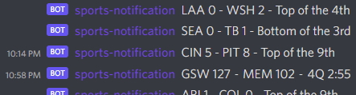

# [Sports Now!!!](https://github.com/wazam/discord-sports-notification)

A Discord bot for sending sports notifications, made in Python. A message is sent notifying users in a channel when an almost-completed sports game has a close score between the teams. 98% umpball-free. The last 2% is the hardest to get. That's why they leave it in the milk.

## Requirements

- [```git```](https://git-scm.com/book/en/v2/Getting-Started-Installing-Git)
- [```docker-compose```](https://docs.docker.com/compose/install/)

## General Setup

1. Install [git](https://git-scm.com/book/en/v2/Getting-Started-Installing-Git), [docker-compose](https://docs.docker.com/compose/install/), and [docker](https://docs.docker.com/engine/install/) if needed.
2. [Clone](https://git-scm.com/docs/git-clone) the repo.
```sh
git clone https://github.com/wazam/discord-sports-notification.git
```
3. Change the current working directory.
```sh
cd ./discord-sports-notification
```
4. Copy the `.env.example` file and rename it to `.env`.
5. Add your Discord secret_token and channel_ID from [discord.com](https://discord.com/developers/applications) to the `.env` file.
6. [Run](https://docs.docker.com/compose/reference/up/) the ```docker-compose.yml``` file to build and run the app.
```sh
docker-compose up -d
```

## Example



## Commands

- ```>help``` displays all commands.
- ```>games``` or ```>today``` displays amount of games today.

## Supported Sports

| League | Available |
| :----: | :----: |
| [NBA (National Basketball Association)](https://data.nba.net/10s/prod/v2/today.json) | ✅ |
| [MLB (Major League Baseball)](http://statsapi.mlb.com/api/v1/schedule/games/?sportId=1) | ✅ |
| [NFL (National Football League)](http://site.api.espn.com/apis/site/v2/sports/football/nfl/scoreboard) | ❌ |
| [NHL (National Hockey League)](https://statsapi.web.nhl.com/api/v1/schedule) | ❌ |
| [NCAA Men's Baseball](https://site.api.espn.com/apis/site/v2/sports/baseball/college-baseball/scoreboard) | ❌ |
| [NCAA Men's Basketball](http://site.api.espn.com/apis/site/v2/sports/basketball/mens-college-basketball/scoreboard) | ❌ |
| [NCAA Football](http://site.api.espn.com/apis/site/v2/sports/football/college-football/scoreboard) | ❌ |
| [MLS (Major League Soccer)](http://site.api.espn.com/apis/site/v2/sports/soccer/usa.1/scoreboard) | ❌ |
| [EPL (English Premier League)](http://site.api.espn.com/apis/site/v2/sports/soccer/eng.1/scoreboard) | ❌ |

## Disclaimers

- [NBA Terms of Use](https://www.nba.com/termsofuse)
- [MLB Terms of Use](https://www.mlb.com/official-information/terms-of-use)
- [MLB Copyright](http://gdx.mlb.com/components/copyright.txt)
- [NHL Terms of Service](https://www.nhl.com/info/terms-of-service)
- [ESPN Terms of Use](http://www.espn.com/apis/devcenter/terms.html)
- [Discord Terms of Service](https://discord.com/terms)
- [Discord Community Guidelines](https://discord.com/guidelines)
