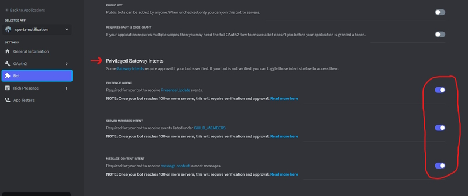

# [Sports Now!!!](https://github.com/wazam/discord-sports-notification)

A Discord bot for sending sports notifications, made in [Python](https://www.python.org/). A message is sent notifying users in a channel when an almost-completed sports game has a close score between the teams. 98% umpball-free. The last 2% is the hardest to get. That's why they leave it in the milk.

## Installation

### Build from source 
1. Install [git](https://git-scm.com/downloads) and [docker-compose](https://docs.docker.com/compose/install/).
2. Clone the repo.
```sh
git clone https://github.com/wazam/discord-sports-notification.git
```
3. Change to the current working directory.
```sh
cd ./discord-sports-notification
```
4. Add your Discord bot's [`secret_token`](https://discord.com/developers/applications) and Server's `channel_ID` to the environment section of the `docker-compose.yml` file.
5. If you want to change [these](https://github.com/wazam/discord-sports-notification#environment-variables) default values, then modify them by adding additional environment variables to the `docker-compose.yml` file.
6. Enable the Discord bot's privileged intents in settings. 
7. Add the bot to your server.
7. [Run](https://docs.docker.com/compose/reference/up/) the ```docker-compose.yml``` file to build and run the app.
```sh
docker-compose up -d
```


### Docker-compose
```sh
---
version: "3"
services:
  app:
    image: ghcr.io/wazam/discord-sports-notification:main
    container_name: discord-sports-notification
    environment:
      - DISCORD_SECRET_TOKEN={{YOUR_VALUE}}
      - DISCORD_CHANNEL_ID={{YOUR_VALUE}}
```


## Example Notifications


## Bot Commands
- ```help``` list of all commands
- ```games``` or ```today``` amount of sports games today
- ```baseball``` or ```mlb``` list of mlb games today
- ```basketball``` or ```nba``` list of nba games today
- ```weather {zip/post code or city/area name}``` current weather


## Environment Variables

### Mandatory
- DISCORD_SECRET_TOKEN={{YOUR_VALUE}}
  - Discord Bot's Client Secret Token (from Developer Portal).
- DISCORD_CHANNEL_ID={{YOUR_VALUE}}
  - Discord Text Channel ID (right-click, "Copy ID").

### Optional
- BOT_REFRESH=300
  - Set the interval in seconds to scrape game information for notification conditions.
- BOT_PREFIX=!
  - Set the command prefix to be used for the bot, in between the quotation marks.
  - Slash commands are available by default now for the bot.
- NBA_ENABLED=True
  - Enable/Disable support for NBA notifications.
- NBA_PERIOD=4
  - Set the earliest period that a notification can activate for.
  - Notification is not sent if period in game is less than this number.
- NBA_PT_DIFFERENTIAL=5
  - Set the highest point differential between the teams that a notification can activate for.
  - Notification is not sent if point differential between teams is higher than this number.
- NBA_MINS_LEFT=4
  - Set the last minutes that a notification can activate for.
  - Notification is not sent if remaining minutes in period is more than this number.
- MLB_ENABLED=True
  - Enable/Disable support for MLB notifications.
- MLB_INNING=9
  - Set the earliest inning that a notification can activate for.
  - Notification is not sent if inning is less than this number.
- MLB_RUN_DIFFERENTIAL=1
  - Set the highest run differential between the teams that a notification can activate for.
  - Notification is not sent if run differential is higher than this number.
- MLB_BASERUNNERS='RISP'
  - Set the minimum amount of baserunners that a notification can activate for.
  - Notification is not sent until this situation occurs on the bases.
  - Options: 'RISP' for 2nd/3rd, 'Men_On' for 1st, 'Empty' for no requirement.
- OPENWEATHERMAP_API_KEY={{YOUR_VALUE}}
  - Free [weather API by OpenWeather](https://openweathermap.org/appid) with account registration. Required for the weather command. 
- TZ=America/New_York
  - Sets localtime for bot based on prefered [tz name](https://en.wikipedia.org/wiki/List_of_tz_database_time_zones).


## Supported Sports
| League | Available | Planned |
| :----: | :----: | :----: |
| [NBA (National Basketball Association)](https://data.nba.net/10s/prod/v2/today.json) | ✅ |   |
| [MLB (Major League Baseball)](http://statsapi.mlb.com/api/v1/schedule/games/?sportId=1) | ✅ |   |
| [NFL (National Football League)](http://site.api.espn.com/apis/site/v2/sports/football/nfl/scoreboard) | ❌ | ✅ |
| [NHL (National Hockey League)](https://statsapi.web.nhl.com/api/v1/schedule) | ❌ | ✅ |
| [NCAA Men's Baseball](https://site.api.espn.com/apis/site/v2/sports/baseball/college-baseball/scoreboard) | ❌ | ❌ |
| [NCAA Men's Basketball](http://site.api.espn.com/apis/site/v2/sports/basketball/mens-college-basketball/scoreboard) | ❌ | ❌ |
| [NCAA Football](http://site.api.espn.com/apis/site/v2/sports/football/college-football/scoreboard) | ❌ | ❌ |
| [MLS (Major League Soccer)](http://site.api.espn.com/apis/site/v2/sports/soccer/usa.1/scoreboard) | ❌ | ❌ |
| [EPL (English Premier League)](http://site.api.espn.com/apis/site/v2/sports/soccer/eng.1/scoreboard) | ❌ | ❌ |


## Disclaimers
- [NBA Terms of Use](https://www.nba.com/termsofuse)
- [MLB Terms of Use](https://www.mlb.com/official-information/terms-of-use)
- [MLB Copyright](https://gdx.mlb.com/components/copyright.txt)
- [NHL Terms of Service](https://www.nhl.com/info/terms-of-service)
- [ESPN Terms of Use](https://web.archive.org/web/20220409030827/http://www.espn.com/apis/devcenter/terms.html)
- [Disney Terms of Use](https://disneytermsofuse.com/english/)
- [Discord Terms of Service](https://discord.com/terms)
- [Discord Community Guidelines](https://discord.com/guidelines)
- [OpenWeatherMap Terms of Use](https://openweather.co.uk/storage/app/media/Terms/Openweather_website_terms_and_conditions_of_use.pdf)
